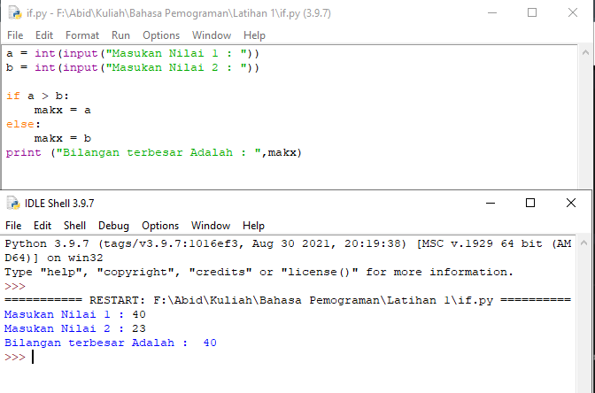
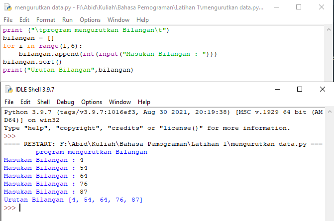
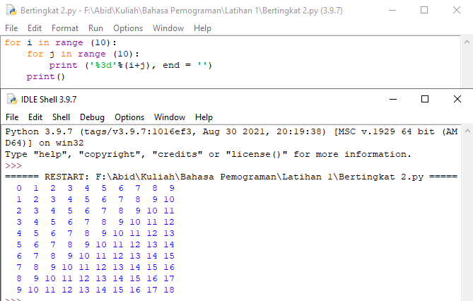
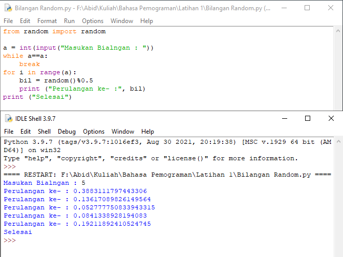

# labspy01
## Latihan 1

<p> Program Sederhana Menampilkan Blangan Terbesar </p>



Penjelasan :

   <p> 1. Buatlah integer untuk menginput bilangan bulat untuk di proses dan dimasukan ke variabel maks </p>

```bash
a = int(input("Masukan Nilai 1 : "))
b = int(input("Masukan Nilai 2 : "))
```
Proses : 
   <p> 2. jika (if) bilangan a lebih besar dari biangan b maka bilangan a lebih besar </p>

```bash
if a > b:
    makx = a
```
   <p> 3. jika (if) bilangan b lebih besar dari bilangan a maka bilangan b lebih besar </p>

```bash
else:
    makx = b
```
   <p> 4. Untuk menampilkan hasil </p>

```bash
print ("Bilangan terbesar Adalah : ",makx)
```

## Latihan 2

<p> Program Menampilkan Sebuah Bilangan Dari Bilangan Terkecil ke Bilangan Terbesar </p>



<p> Penjelasan : </p>

   <p> 1. Untuk menginput lima buah bilangan yang akan dimasukan ke list variabel </p>

```bash
bilangan = []
for i in range(1,6):
    bilangan.append(int(input("Masukan Bilangan : ")))
```

  <p>  2. Data akan diproses menggunakan metode sort. yaitu metode untuk mengurutkan data, baik itu dari nilai terkecil ataupun terbesar. </p>

```bash
bilangan.sort()
```
   <p> 3. Untuk Menapilkan Data </p>

```bash
print("Urutan Bilangan",bilangan)
```
<p> SELESAI </p>

## Latihan 3

<p> Program Perulangan Bertingkat (Nested for) </p>



<p> Penjelasan :
Note : i (Baris), j (Kolom) </p>

  <p>  1. Untuk melakukan perulangan baris dan kolom dengan nilai 10, menggunakan nested for </p>

```bash
for i in range (10):
    for j in range (10):
        
```
  <p>  2. Untuk hasil dari perulangan </p>

```bash
print ('%3d'%(i+j), end = '')
    print()
```

## Latihan 4

<p> Program Menampilkan N Bilangan Acak yang Lebih Kecil dari 0.5 </p>



Penjelasan :

   <p> 1. Import Module Bilangan Random </p>

```bash
from random import random
``` 

   <p> 2. Untuk menginput nilai yang ingin dikonversikan kedalam bilangan bulat (Integer) yang akan di masukan kedalam variabel a </p>

```bash
a = int(input("Masukan Bialngan : "))
```
  <p>  3. Untuk pengulangan range yang diinputkan oleh variable a </p>

```bash
while a==a:
    break
for i in range(a):
    bil = random()%0.5
```

  <p>  4. Untuk Menampilkan bialangan a </p>

```bash
 print ("Perulangan ke- :", bil)
print ("Selesai")
```